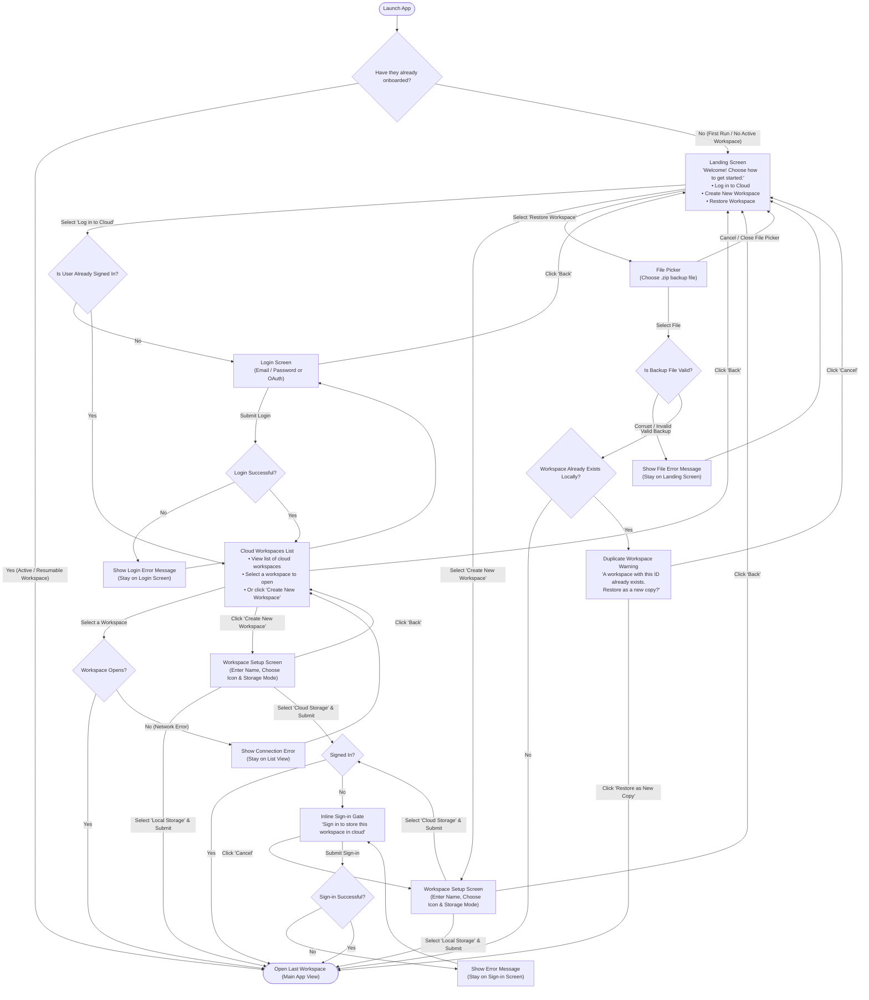

# Onboarding Flow Diagram (User-Facing)

This document shows the user-facing onboarding flows for Kalaido, detailing the screens users see, the actions they take, and the decisions they make.

---

## User Flowchart

---

## User Screens & Decisions Summary

| Screen / Step | What the User Sees / System Check | Decisions / Actions Available | Next Destination |
| :--- | :--- | :--- | :--- |
| **0. Entry Check** | System checks if user has previously onboarded | • **Yes**: Resumable workspace exists • **No**: First run or no active workspace | Open Last Workspace Landing Screen |
| **1. Landing Screen** | Welcome message with 3 primary action cards | • Choose **Log in to Cloud** • Choose **Create New Workspace** • Choose **Restore Workspace** | Login Screen / Cloud List Workspace Setup Screen File Picker |
| **2. Login Screen** | Email/Password inputs & OAuth buttons | • Submit credentials • Click **Back** | Cloud Workspaces List (on success) Landing Screen |
| **3. Cloud Workspaces List** | Cards for each of the user's cloud workspaces + a "Create New Workspace" option | • Click a workspace to open it • Click **Create New Workspace** • Click **Back** | Opened Workspace Workspace Setup Screen Landing Screen |
| **4. Workspace Setup** | Form to enter name, pick an icon, and choose Local vs. Cloud storage | • Submit with Local Storage • Submit with Cloud Storage • Click **Back** | Opened Workspace Inline Sign-in (if signed out) / Opened Workspace Landing Screen or Cloud List |
| **5. Inline Sign-in Gate** | Sign-in form framed as "Sign in to store this workspace in cloud" | • Submit sign-in • Click **Cancel** | Workspace Created & Opened (on success) Workspace Setup Screen (inputs kept) |
| **6. Restore File Picker** | Native OS file picker dialog | • Select a `.zip` file • Cancel dialog | Validation check Landing Screen |
| **7. Duplicate Warning Modal** | Warning dialog stating a workspace with the same ID already exists | • Click **Restore as New Copy** • Click **Cancel** | Restored as new copy & Opened Landing Screen |
